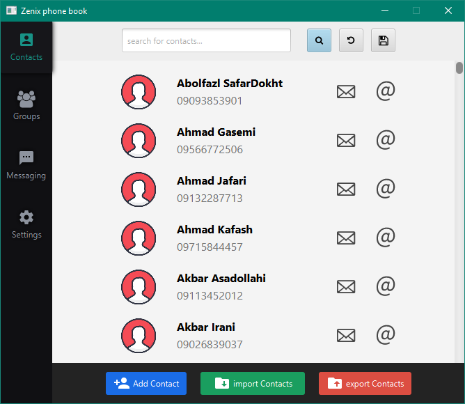

# about this project

Zenix Phone Book was a university project built using JavaFx and Java.
it supposed to have messaging and emailing features but because of lacking in time, we never implemented it.

## Features of this program:

- Custom UI thanks to javaFX and CSS
- Add , remove and update contacts
- Search for contacts
- Auto save after changes to contacts file when program quits
- save searched contacts to another file

although the program itself is fast but after any contact change, program re-renders the whole contacts after any change to them. I didn’t have time to write code for remove/update single contact in view so that’s the reason why it slows for a while after any change in contacts!
